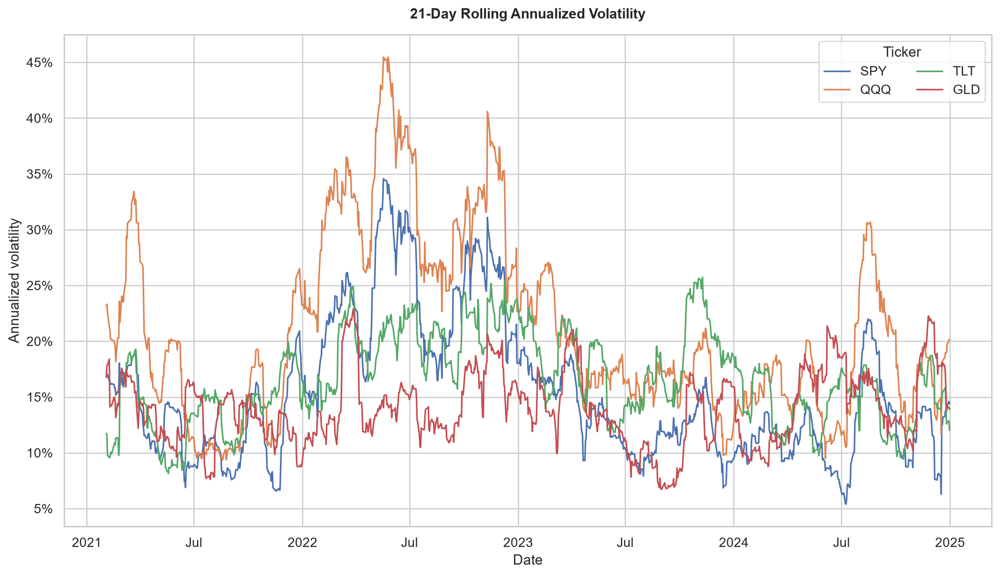
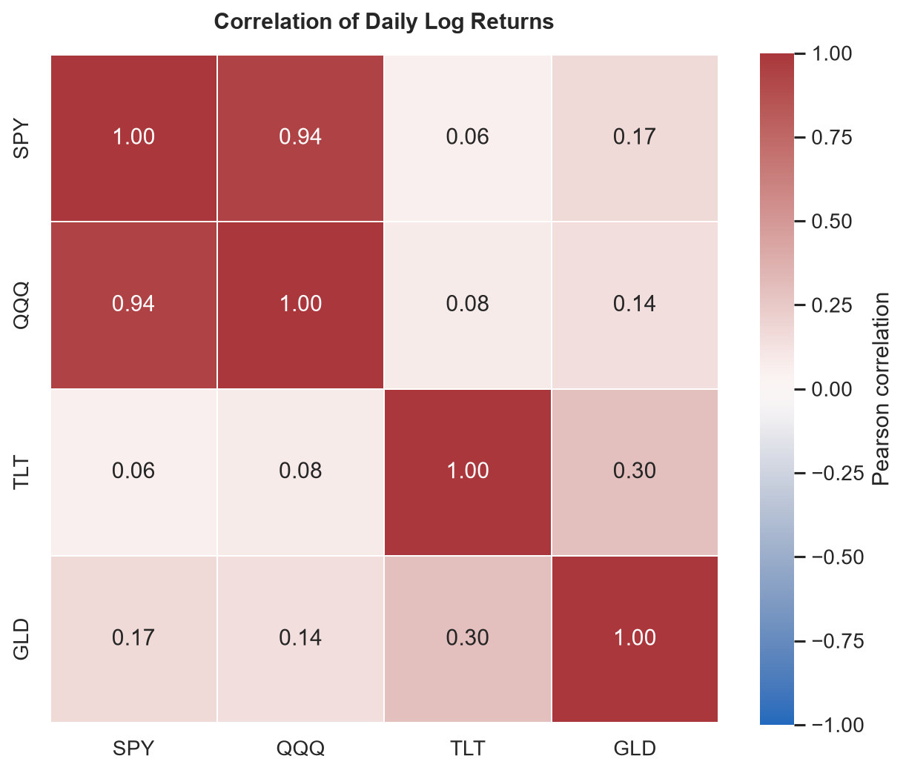

# Historical Asset Risk Engine

A Python CLI and reusable package for reproducible historical market-risk
analysis. It validates adjusted daily prices for two or more assets, calculates
returns and risk statistics, and writes tables, charts, quality evidence, and
source lineage. It can also value a portfolio from explicit instrument, position,
and cash records.

Results describe a historical sample. They are not forecasts or investment advice.

## Capabilities

- Yahoo Finance and local CSV market-data providers
- Simple and logarithmic returns
- Distribution summaries and daily/annualized volatility
- Multi-asset covariance and Pearson correlation
- Trailing volatility, covariance, and correlation
- Data-quality reports and reproducible run manifests
- Optional portfolio valuation, weights, and exposure measures
- CLI and importable Python APIs

```text
adjusted prices -> validation and alignment -> returns -> risk estimates
                                                         |
                                                         v
                             tables, charts, quality report, manifest
```

Adjusted prices prevent splits and cash distributions from appearing as ordinary
market gains or losses. Cross-asset statistics use one complete set of common
dates.

## Installation

Python 3.12 or later is required.

```powershell
conda env create -f environment.yml
conda activate historical-asset-risk-engine
python -m pip install --no-deps --no-build-isolation -e .
```

To update an existing environment:

```powershell
conda env update -n historical-asset-risk-engine -f environment.yml --prune
conda activate historical-asset-risk-engine
python -m pip install --no-deps --no-build-isolation -e .
```

`environment.yml` installs the exact Python resolution in `requirements.lock`.
CI follows these same steps so the documented setup is continuously tested.

## Quick start

Run the four-asset Yahoo Finance example:

```powershell
historical-asset-risk --config config.example.toml
```

It analyzes `SPY`, `QQQ`, `TLT`, and `GLD` from 2021 through 2024 with a
21-observation rolling window, values the bundled synthetic portfolio, and writes
to `outputs/example/`. This run requires network access. `examples/data/` is safe
to commit; the ignored root `data/` directory is reserved for private or licensed
user data.

Run a Yahoo Finance analysis:

```powershell
historical-asset-risk --tickers SPY QQQ TLT GLD --start-date 2021-01-01 --end-date 2025-01-01 --rolling-window 21
```

Yahoo requires internet access. `end_date` is exclusive, so the example excludes
January 1, 2025. Results go to `outputs/` unless `--output-dir` is supplied.

Use `historical-asset-risk --help` for all CLI options.

## Configuration

Configuration may be TOML or JSON. TOML may use `[analysis]`; JSON may use a
top-level object or an `analysis` object.

```toml
[analysis]
provider = "yahoo"
tickers = ["SPY", "QQQ", "TLT", "GLD"]
start_date = "2021-01-01"
end_date = "2025-01-01"
rolling_window = 21
rolling_min_observations = 21
observations_per_year = 252
quantiles = [0.05, 0.25, 0.75, 0.95]
quantile_method = "linear"
downside_target = 0.0
output_dir = "outputs"
```

```powershell
historical-asset-risk --config analysis.toml
```

Precedence is command line, then configuration file, then built-in defaults.

## Market-data inputs

### Yahoo Finance

Yahoo is the default provider. The adapter uses `yfinance` with
`auto_adjust=False`, explicitly selects `Adj Close`, and never substitutes raw
closing prices. Requested tickers are downloaded sequentially to avoid races in
`yfinance`'s shared SQLite cache; this affects acquisition speed, not the returned
price definition or downstream calculations.

If Yahoo reports `database is locked`, close other Python processes using
`yfinance`, remove its local cache, and retry:

```powershell
python -c "import yfinance as yf; print(yf.cache.get_cache_location())"
# Remove the printed cache directory only after checking the path.
```

A successful Yahoo run also writes `acquired_adjusted_prices.csv`: normalized,
requested, in-range records after duplicate and price-value handling but before
complete-case alignment. Missing observations remain visible for inspection and
CSV-provider reuse. There is no automatic fallback to a file or cache.

### Local CSV

```powershell
historical-asset-risk --provider csv --csv-path examples/data/adjusted_prices.csv --tickers SPY QQQ TLT GLD --start-date 2024-01-01 --end-date 2024-02-01 --rolling-window 3
```

The CSV must be in long form. Additional columns are ignored.

| Column | Requirement |
| --- | --- |
| `date` | Parseable date satisfying `start_date <= date < end_date` |
| `ticker` | Symbol; trimmed and normalized to uppercase |
| `adjusted_close` | Numeric adjusted close greater than zero |

Do not place raw closes in `adjusted_close`; the engine cannot reconstruct
provider-specific split or distribution adjustments.

### Validation and alignment

- Yahoo and CSV records use the same normalization and validation.
- Missing, nonnumeric, zero, and negative prices are never filled.
- Duplicate date/ticker rows keep the last source row and are disclosed.
- A date is retained only when every requested asset has a valid price.
- Prices are never forward-filled.
- The run fails if alignment would create a return spanning an intervening
  provider observation date.
- Rolling analysis requires at least `rolling_min_observations + 1` aligned prices.
- The combined return summary requires at least four non-missing log returns per
  asset.

Complete-case alignment gives every asset pair a consistent sample, but it may
shorten history and introduce selection effects. The quality report records the
reduction.

## Outputs

| Purpose | Files |
| --- | --- |
| Validated prices | `adjusted_prices.csv` |
| Returns | `simple_returns.csv`, `log_returns.csv`, `return_summary.csv` |
| Volatility | `volatility_summary.csv`, `rolling_volatility.csv`, `rolling_volatility.png` |
| Dependence | `covariance_matrix.csv`, `rolling_covariance.csv`, `correlation_matrix.csv`, `rolling_correlation.csv`, `correlation_heatmap.png` |
| Reproducibility | `data_quality_report.json`, `run_manifest.json` |

Yahoo runs add `acquired_adjusted_prices.csv`. Portfolio runs add:

- `validated_instruments.csv`
- `validated_positions.csv`
- `portfolio_valuation.csv`
- `portfolio_exposure_summary.csv`

Portfolio runs also emit the Phase 4 book P&L and risk layer:

- `portfolio_aligned_simple_returns.csv` — held-book simple returns aligned by
  `instrument_id` with explicit intervals
- `hypothetical_portfolio_pnl.csv` — current-book historical simulation P&L and
  loss (`loss = -pnl`) over each return interval
- `portfolio_simple_return_covariance.csv`,
  `portfolio_simple_return_correlation.csv`,
  `simple_return_summary.csv` — sample simple-return covariance risk inputs,
  distinct in schema id and units from the log-return `covariance_matrix.csv`
- `portfolio_risk_summary.csv` — return- and currency-space variance and
  volatility from `w' Sigma w` / `x' Sigma x`, with a labeled
  square-root-of-time annualized volatility
- `portfolio_risk_contributions.csv` — Euler marginal, component, and percentage
  volatility contributions; negative hedge contributions are kept, not clipped
- `portfolio_concentration_summary.csv` — gross weight, Herfindahl, effective
  names

Passing `--positions-history-path` and `--cash-history-path` (an ordered
collection of dated Phase 3 snapshots, same row schema) additionally writes
`proxy_realized_portfolio_pnl.csv` and the versioned `risk_realizations.csv`
identity that a downstream forecasting engine can join its own predictions to.
HARE does not generate forecasts or run coverage tests.

Portfolio runs also measure the tail of that released loss sample (Phase 5):

- `portfolio_value_at_risk.csv` — canonical historical VaR
  `L_(ceil(n * alpha))`, in return and currency dimensions, never floored at
  zero. The descriptive `--quantile-method` never redefines this.
- `portfolio_expected_shortfall.csv` plus
  `portfolio_expected_shortfall_tail_weights.csv` — exact finite-sample ES with
  the audit weights that produce it
- `tail_risk_comparison.csv` — historical VaR/ES beside the mean-included and
  zero-mean Gaussian benchmarks (a comparison, not a normality claim)
- `trailing_portfolio_tail_risk.csv` — with an exposure history, VaR/ES rebuilt
  at each `as_of_date` from that day's snapshot; a risk report, not a forecast

Set `--tail-risk-confidence-level` (default 0.95) and `--tail-risk-window`.
Passing `--stress-catalog-path` (a hash-verified scenario catalog JSON) applies
named `instrument_id` simple-return shocks to the current book and writes
`stress_scenario_catalog.json`, `stress_test_results.csv`, and
`stress_contributions.csv`. Scenarios carry no probability.

## Example results

These figures use 1,004 complete-case daily log returns for `SPY`, `QQQ`,
`TLT`, and `GLD` from Yahoo Finance adjusted closes, covering January 5, 2021,
through December 31, 2024. The volatility estimate uses a trailing window of 21
trading observations, sample standard deviation (`ddof=1`), and square-root-of-
time annualization with 252 observations per year. The correlation heatmap shows
full-sample Pearson correlations. Results are historical descriptions, not
forecasts.





## Statistical conventions

Statistical estimators use daily log returns. Simple returns are a separate output.

| Metric | Convention |
| --- | --- |
| Simple return | `P(t) / P(t-1) - 1` |
| Log return | `log(P(t) / P(t-1))` |
| Basic summary | Sample mean, median, minimum, maximum, and standard deviation with `ddof=1` |
| Quantiles | Configurable; defaults are 5%, 25%, 75%, and 95% with `linear` interpolation |
| Skewness | Bias-corrected Fisher-Pearson sample skewness |
| Excess kurtosis | Bias-corrected Fisher excess kurtosis |
| Downside deviation | `sqrt(sum(min(r - target, 0)^2) / n)` over all non-missing observations; not annualized |
| Daily volatility | Sample standard deviation with `ddof=1` |
| Annualized volatility | Daily volatility times `sqrt(observations_per_year)` |
| Covariance | Daily complete-case sample covariance with `ddof=1`; not annualized |
| Correlation | Complete-case sample-centered Pearson correlation |
| Rolling estimates | Corresponding estimator over a trailing window that includes the current observation |

`observations_per_year` defaults to 252 and affects only volatility annualization.
Square-root-of-time scaling is a baseline approximation. The daily log-return
downside target defaults to zero; its denominator includes all non-missing
observations, not only shortfalls. Correlation is undefined for a constant series
and does not establish causation.

`rolling_min_observations` defaults to `rolling_window`, leaving the first
`window - 1` estimates empty. A smaller minimum permits incomplete trailing
windows; it must be at least two and cannot exceed the window. Rolling covariance
and correlation CSVs use `(date, ticker)` row keys and one column per paired
ticker. The manifest records all conventions in machine-readable form.

## Optional portfolio valuation

Portfolio valuation is enabled only when the instrument registry, positions file,
and cash file are all supplied.

`adjusted_close` is a historical adjusted series for returns. `valuation_price` is
a point-in-time price for a signed quantity. The engine never substitutes one for
the other.

```text
position value          = signed quantity * valuation price
long exposure           = sum of positive position values
short exposure          = sum of negative position values
gross exposure          = sum of absolute position values
net instrument exposure = sum of signed position values
portfolio value         = cash + net instrument exposure
```

Weights and ratios divide by calculated portfolio value. A zero or negative value
fails explicitly. Use `calculate_currency_valuation` when only currency values are
needed.

### Input contracts

Runnable synthetic inputs are in `examples/data/`.

| File | Required columns |
| --- | --- |
| Instrument registry | `instrument_id`, `provider_ticker`, `listing_venue`, `instrument_type`, `price_currency`, `market_calendar_id`, `market_timezone`, `adjusted_return_series_id`, `return_adjustment_basis` |
| Positions | `portfolio_snapshot_id`, `portfolio_id`, `as_of_date`, `instrument_id`, `quantity`, `valuation_price`, `valuation_price_timestamp`, `valuation_price_source`; optional `source_row_id` |
| Cash | `portfolio_snapshot_id`, `portfolio_id`, `as_of_date`, `as_of_timestamp`, `base_currency`, `market_calendar_id`, `market_timezone`, `cash_amount`, `cash_source` |

Unknown columns are rejected. Additional rules:

- `instrument_type` is `equity` or `standard_etf`; `standard_etf` asserts that the
  fund is neither leveraged nor inverse.
- Canonical IDs, provider tickers, and adjusted-return-series IDs stay separate
  for reconciliation and lineage.
- `source_row_id` is unique when present.
- Quantities are finite, signed, and non-zero; valuation prices are finite and
  strictly positive.
- Duplicate snapshot/instrument positions are rejected, not aggregated.
- Exactly one cash row is required, including when cash is zero.
- Cash is signed. The engine does not infer short-sale proceeds, financing,
  interest, margin, or borrow costs.

### Portfolio validation

- Every held instrument exists in the registry. When a market-data universe is
  supplied, every held provider ticker must also be selected.
- Registry identifiers and position source-row identifiers are unique.
- Instruments share the portfolio base currency, calendar, and timezone.
- The built-in `XNYS` calendar covers 1990–2035 and requires
  `America/New_York`.
- Snapshot and price timestamps include a UTC offset consistent with that timezone
  and belong to the session date.
- A price timestamp cannot be later than the snapshot timestamp.
- Outputs preserve source lineage and include a deterministic
  `exposure_snapshot_id`.
- Reordering registry or position rows does not change this ID; changing normalized
  material content does.
- A run refuses to overwrite a different exposure snapshot in the same output
  directory.

## Python API

For a shared experiment or downstream application, install an immutable commit:

```powershell
python -m pip install "historical-asset-risk-engine @ git+https://github.com/SIRE02/historical-asset-risk-engine.git@<commit>"
```

Everything re-exported from the top-level `historical_asset_risk` namespace is
the supported, versioned surface: the pure calculation functions from every
phase, their result and contract dataclasses, the artifact schema registry
(`ARTIFACT_SCHEMAS`, `ARTIFACT_UNITS`), `load_artifact`, `AnalysisConfig`, the
CSV readers, and the market calendar. `historical_asset_risk.__all__` is the
authoritative list. Run orchestration (`cli.run_analysis`, `compute_phase4`,
`compute_phase5`), providers, and plotting are intentionally not part of that
surface; import them from their submodules if you need them. Every estimator is
documented under [`docs/methodology/`](docs/methodology/README.md).

### Calculate statistics in memory

```python
import pandas as pd

from historical_asset_risk import (
    calculate_log_returns,
    correlation_matrix,
    volatility_summary,
)

prices = pd.DataFrame(
    {
        "SPY": [100.0, 101.0, 102.0, 101.0, 103.0],
        "QQQ": [50.0, 51.0, 50.0, 52.0, 53.0],
        "TLT": [90.0, 90.5, 89.5, 91.0, 90.0],
        "GLD": [180.0, 181.0, 180.5, 182.0, 183.0],
    },
    index=pd.to_datetime(
        ["2024-01-02", "2024-01-03", "2024-01-04", "2024-01-05", "2024-01-08"]
    ),
)
prices.index.name = "date"

log_returns = calculate_log_returns(prices)
volatility = volatility_summary(log_returns, observations_per_year=252)
correlations = correlation_matrix(log_returns)
```

Calculation modules perform no network access and create no files.

### Load an artifact

```python
from pathlib import Path

from historical_asset_risk import load_artifact

root = Path("outputs/example")
simple_returns = load_artifact(
    root / "simple_returns.csv",
    root / "run_manifest.json",
)
```

For every supported CSV, `load_artifact` requires a recognized filename and a
matching manifest declaration for schema identity, version, and units. Price and
return matrices also validate dates, numeric values, and instrument ordering.
Portfolio artifacts enforce strict columns and relevant manifest identities.
Summary and dependence tables are not exhaustively validated cell by cell.

Artifact schemas are experimental. Consumers should explicitly support the
versions and table shapes they accept.

### Value a portfolio

```python
from pathlib import Path

from historical_asset_risk import (
    read_cash,
    read_instrument_registry,
    read_positions,
    validate_portfolio_snapshot,
    value_portfolio,
)

root = Path("examples/data")
snapshot = validate_portfolio_snapshot(
    read_instrument_registry(root / "instrument_registry.csv"),
    read_positions(root / "positions.csv"),
    read_cash(root / "cash.csv"),
    market_data_instruments=("SPY", "QQQ", "TLT", "GLD"),
)
valuation = value_portfolio(snapshot)
```

Immutable data classes and typed exceptions live in
`historical_asset_risk.contracts`. Copying `src/historical_asset_risk` into another
repository is unsupported; install the package so versions and dependencies remain
explicit.

## Quality and reproducibility

`data_quality_report.json` records requested and returned instruments, actual common
dates, per-instrument counts, duplicates, invalid/missing prices, alignment
reduction, and optional portfolio reconciliation.

`missing_adjusted_close_values` covers requested, in-range, deduplicated records.
`source_missing_adjusted_close_values` covers the provider-normalized source before
scope filters.

`run_manifest.json` records:

- Package version, source commit when available, and execution time. VCS installs
  use their immutable installation metadata; editable source checkouts query only
  this package's repository, never the caller's working directory.
- Effective configuration
- Actual provider, source, read/acquisition time, range, and instruments
- Dependency versions
- Generated artifacts with schema identities, versions, and units
- Estimation and missing-data conventions
- Portfolio sources, calendar, reconciliation, and snapshot identity when enabled

CSV runs also record the resolved source path and file modification time. These
reports describe the data actually analyzed, not only what was requested.

## Limitations

- Results are historical descriptions, not predictions.
- Complete-case alignment can reduce the sample and introduce selection effects.
- Volatility annualization assumes square-root-of-time scaling.
- Yahoo supplies adjusted values; this project does not independently reconstruct
  or guarantee its methodology, corrections, or completeness.
- Provider availability, response shape, rate limits, and historical values may
  change. Retain the acquisition file and manifest for reproducibility.
- `yfinance` is independent of and not endorsed by Yahoo. Users must determine
  permitted use under the [yfinance notice](https://pypi.org/project/yfinance/)
  and [Yahoo API terms](https://legal.yahoo.com/us/en/yahoo/terms/product-atos/apiforydn/index.html).
- Software and market data have separate licensing considerations.

Expected validation failures exit with a concise `Analysis failed: ...` message.

## Development

Tests use deterministic synthetic data and saved provider-shaped responses; they
do not require network access.

```powershell
conda run -n historical-asset-risk-engine python -m pytest -q
```

Run all CI checks:

```powershell
python -m pip install -r requirements.lock
python -m pip install --no-deps --no-build-isolation -e .
python -m ruff format --check .
python -m ruff check .
python -m mypy
python -m pytest -q
python -m build
```

The suite covers calculations, rolling boundaries, no-look-ahead behavior,
alignment, Yahoo/CSV equivalence, reports, portfolio valuation, P&L, covariance
risk, VaR/ES, stress, frozen schema contracts, the public API surface,
packaging, clean installation, and the installed CLI.

Version history is in [CHANGELOG.md](CHANGELOG.md); methodology per estimator is
in [`docs/methodology/`](docs/methodology/README.md).

## License

Licensed under the MIT License. See [LICENSE](LICENSE).
